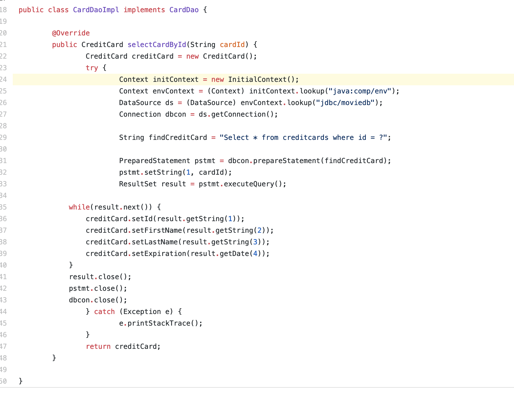

# JDBC connection pooling
## DataBase Connection Configuration
- Database connection is configured in the context.xml and web.xml, see the link below.
- context.xml
>https://github.com/UCI-Chenli-teaching/cs122b-winter19-team-10/blob/master/cs122b-project/WebContent/META-INF/context.xml

- web.xml
>https://github.com/UCI-Chenli-teaching/cs122b-winter19-team-10/blob/master/cs122b-project/WebContent/WEB-INF/web.xml

## Places where tomcat pooling is used

### How is it used

- we search for a data source to search for a available connection. The general format of access the JDBC connection pool is the same.

### Where tomcat pooling is used
1. [CardDaoImpl.java](https://github.com/UCI-Chenli-teaching/cs122b-winter19-team-10/blob/master/cs122b-project/src/com/cs122b/fablix/dao/Impl/CardDaoImpl.java)
- line 24
2. [CustomerDaoImpl.java](https://github.com/UCI-Chenli-teaching/cs122b-winter19-team-10/blob/master/cs122b-project/src/com/cs122b/fablix/dao/Impl/CustomerDaoImpl.java)
- line 29
- line 57
3. [EmployeeDaoImpl](https://github.com/UCI-Chenli-teaching/cs122b-winter19-team-10/blob/master/cs122b-project/src/com/cs122b/fablix/dao/Impl/EmployeeDaoImpl.java)
- line 25
- line 53
4. [FuzzySearchDaoImpl.java](https://github.com/UCI-Chenli-teaching/cs122b-winter19-team-10/blob/master/cs122b-project/src/com/cs122b/fablix/dao/Impl/FuzzySearchDaoImpl.java)
- line 23
5. [GenreDaoImpl.java](https://github.com/UCI-Chenli-teaching/cs122b-winter19-team-10/blob/master/cs122b-project/src/com/cs122b/fablix/dao/Impl/GenreDaoImpl.java)
- line 26
- line 59
- line 86
- line 117
- line 148
6. [MetaDaoImpl.java](https://github.com/UCI-Chenli-teaching/cs122b-winter19-team-10/blob/master/cs122b-project/src/com/cs122b/fablix/dao/Impl/MetadataImpl.java)
- line 23
7. [MovieDaoImpl.java](https://github.com/UCI-Chenli-teaching/cs122b-winter19-team-10/blob/master/cs122b-project/src/com/cs122b/fablix/dao/Impl/MovieDaoImpl.java)
- line 28
- line 62
- line 96
- line 134
- line 165
- line 213
- line 286
- line 329
- line 360
- linr 392
- line 418
- line 473
- line 502
- line 555
8. [RatingDaoImpl](https://github.com/UCI-Chenli-teaching/cs122b-winter19-team-10/blob/master/cs122b-project/src/com/cs122b/fablix/dao/Impl/RatingDaoImpl.java)
- line 21
- line 47
9. [SalesDaoImpl.java](https://github.com/UCI-Chenli-teaching/cs122b-winter19-team-10/blob/master/cs122b-project/src/com/cs122b/fablix/dao/Impl/SalesDaoImpl.java)
- line 29
10. [StarDaoImpl.java](https://github.com/UCI-Chenli-teaching/cs122b-winter19-team-10/blob/master/cs122b-project/src/com/cs122b/fablix/dao/Impl/StarDaoImpl.java)
- line 26
- line 55
- line 81
- line 106
- line 126
- line 155
